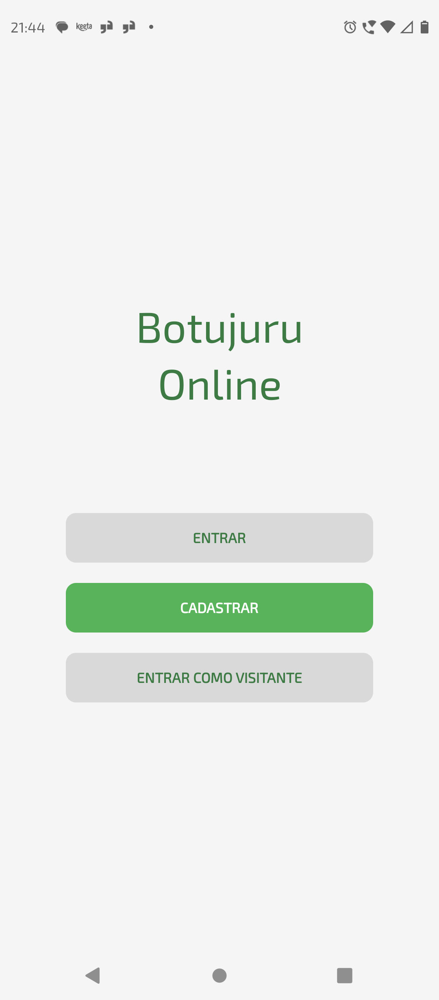
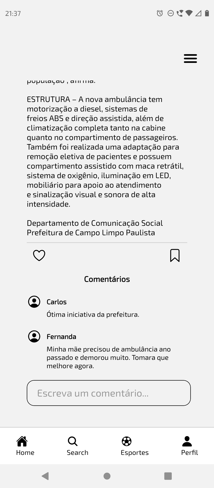

# 📱 Botujuru Online App
Protótipo de aplicativo mobile de notícias locais para o bairro Botujuru, em Campo Limpo Paulista (SP), baseado no site [Botujuru Online](https://www.botujuruonline.com.br/), desenvolvido e mantido por Cleber Aguiar.

Projeto desenvolvido como Atividade Extensionista II do curso de Análise e Desenvolvimento de Sistemas da UNINTER.

---

## 👩‍💻 Desenvolvedoras

- [mands-mands](https://github.com/mands-mands)
- [gigiofontoura](https://github.com/gigiofontoura)

---

## 🎯 Objetivo

Facilitar o acesso dos moradores do bairro Botujuru e região às notícias e informações locais por meio de dispositivos móveis, promovendo inclusão digital e participação cidadã na comunidade.

---

## 🚀 Tecnologias utilizadas

- [React Native](https://reactnative.dev/)
- [JavaScript](https://developer.mozilla.org/pt-BR/docs/Web/JavaScript)
- [Expo Go](https://expo.dev/go)

---

## 📋 Funcionalidades

- Tela de login e cadastro de usuário
- Tela principal com últimas notícias
- Menu de categorias (saúde, política, cultura, contato)
- Barra de navegação inferior com acesso rápido a Home, Pesquisa, Esportes e Perfil
- Perfil do usuário com notícias salvas
- Tela de notícia completa com seção de comentários

---

## 📸 Screenshots

<p align="center">
  
  
  
  
</p>

## ⚙️ Como rodar o projeto localmente

### Pré-requisitos

- [Node.js](https://nodejs.org/) instalado
- Aplicativo **Expo Go** instalado no celular ([Android](https://play.google.com/store/apps/details?id=host.exp.exponent) | [iOS](https://apps.apple.com/app/expo-go/id982107779))
- Computador e celular na **mesma rede Wi-Fi**

### Passo a passo

1. Clone o repositório:
```bash
git clone https://github.com/mands-mands/botujuru-online-app.git
```

2. Abra o projeto em sua IDE de preferência

3. Em sua IDE, abra o terminal integrado e instale as dependências:
```bash
npm install
```

4. Inicie o projeto:
```bash
npx expo start
```

5. Abra o aplicativo **Expo Go** no celular e escaneie o QR Code exibido no terminal.

6. Explore o protótipo, navegue entre as telas.

> ⚠️ **Problema de conexão?** Tente rodar com tunnel:
> ```bash
> npx expo start --tunnel
> ```

---

## 📁 Estrutura do projeto

```
botujuru-online-app/
├── src/                # Telas e componentes do aplicativo
├── assets/             # Imagens e ícones
├── App.js
├── index.js
├── app.json
└── package.json
```

---

## 📌 Observações

- Este projeto é um **protótipo funcional** desenvolvido para fins acadêmicos.
- As notícias e imagens utilizadas pertencem ao site Botujuru Online e foram utilizadas com autorização do proprietário, Cleber Aguiar.

---

## 📄 Licença

Projeto acadêmico — sem fins comerciais.
